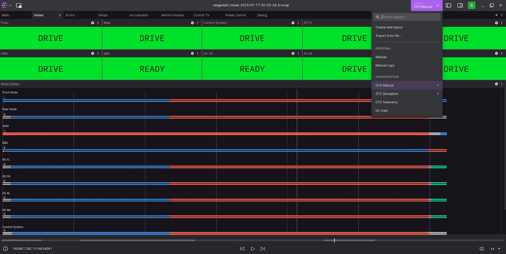
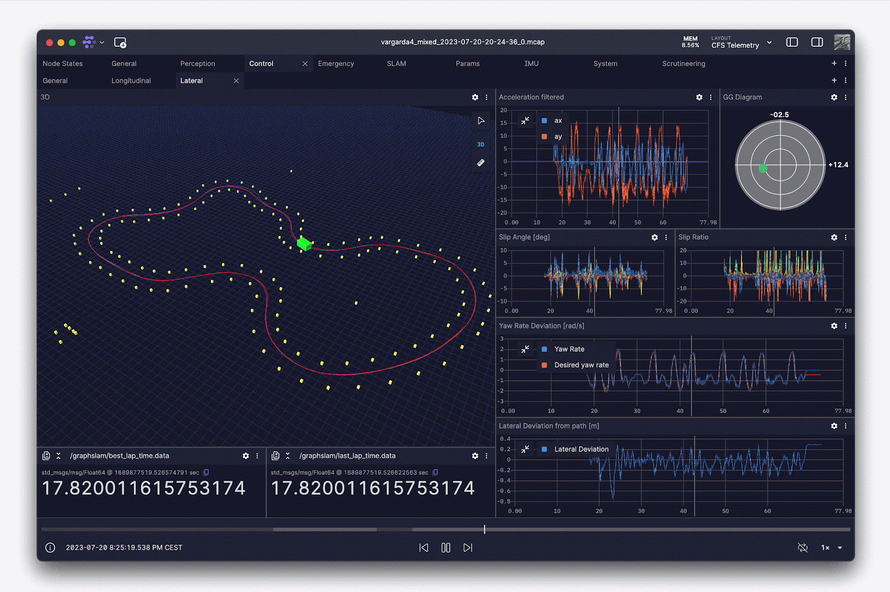
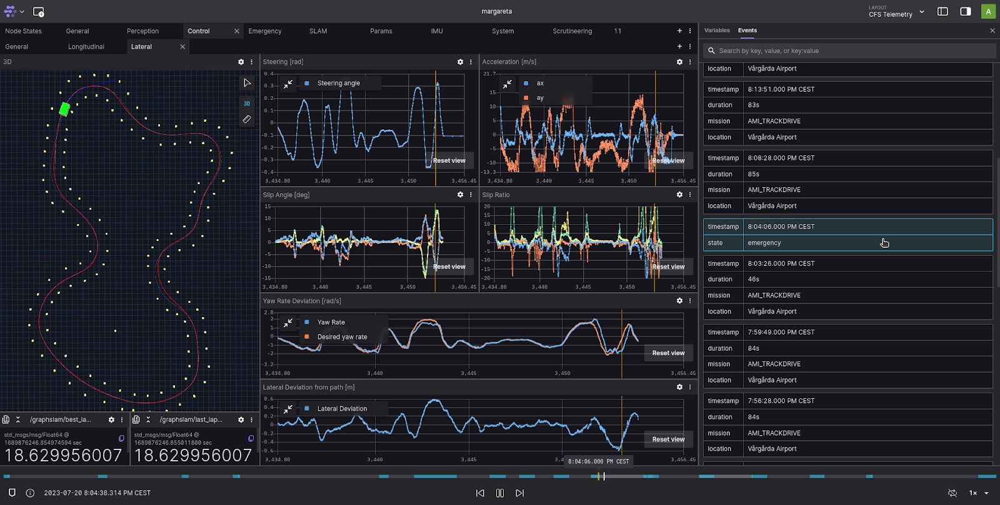
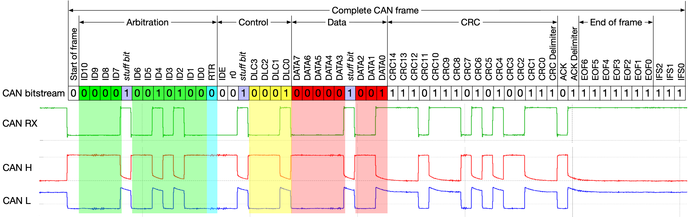
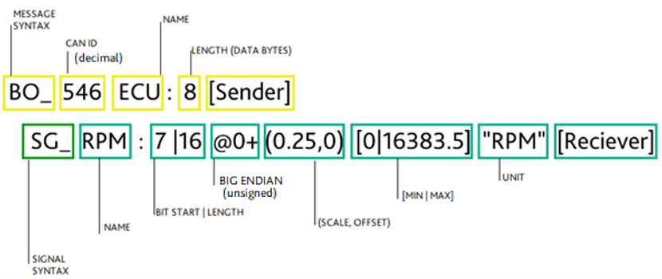
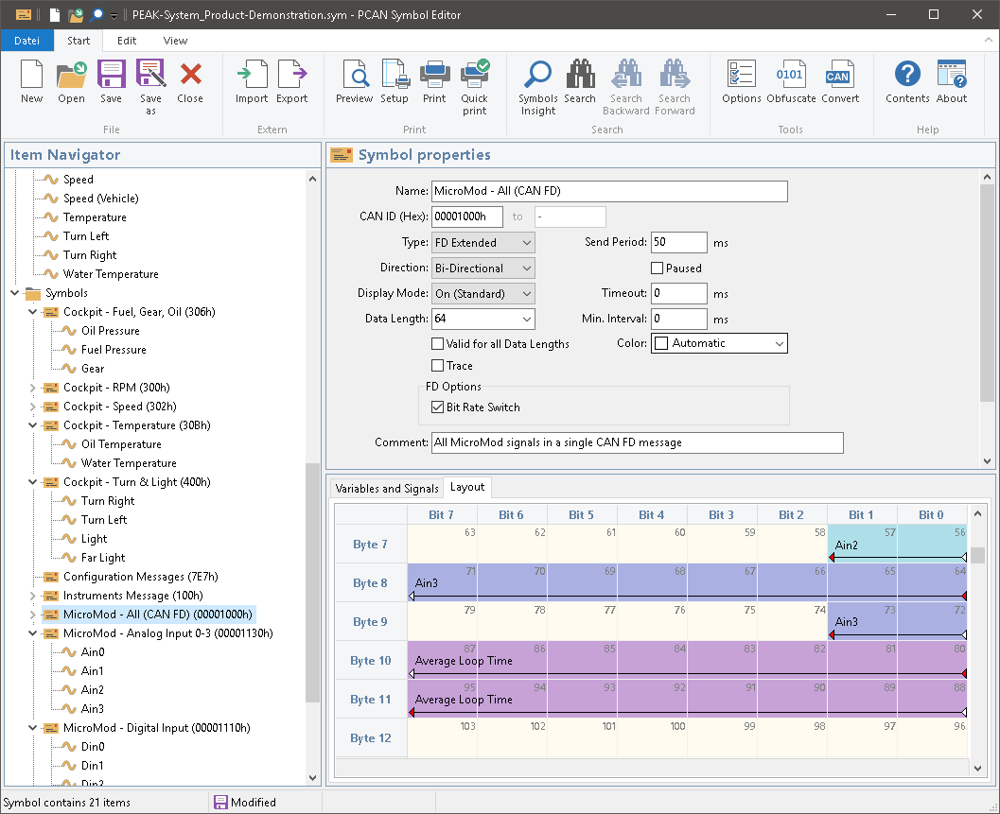

# <!--fit--> A new approach to data acquisition

By: Ben Hall

---
## overview
- what is the purpose of data acq?
    - live data viewing
    - "run to run" data recording
    - long-term data storage and ease of access to previous recordings
    - car performance over time

---
### from this:

---
### to this:

---
### foxglove studio used by Chalmers team in Formula Student

---
### foxglove studio

---

---
### foxglove studio features
- foxglove studio can graph, show live video feed, and even show our GPS position on a google maps overlay.
- can run soley in a browser with no downloads required
- can re-play mcap data
- mcap files (run to run data reccording)
    - mcap file = smartly encoded binary file and is distinctly NOT a database

---
### how do we get there?
- misconception: foxglove studio != ROS required
- two main problems:
    - raw serialized CAN data ⮕ ? ⮕ foxglove live view 
    - raw serialized CAN bus data ⮕ ? ⮕ mcap file 
---
## on CAN and DBC files
- CAN is the largest source of data on the car
    - most of the boards connect over CAN
    
    - CAN = serialized protocol
    

---
## on CAN and DBC files
- The standard way of handling this process is through DBC files.
    - [introduction to dbc files](https://www.csselectronics.com/pages/can-dbc-file-database-intro)
    - DBC files can be used by numerous tools for analysis and automatic deserialization of CAN traffic via libraries like `cantools` or any of the other tools [lists here](https://github.com/iDoka/awesome-canbus?tab=readme-ov-file#converters-and-parsers)

    
---

## SYM; a better DBC file
- an alternative to DBC file that conveys the same information (and can easily be convert to DBC) is a SYM file
    
- generated by PCAN editor 6

---
